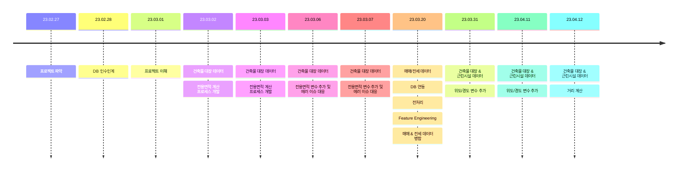

# One_Bite

### 개발 히스토리

github을 사용한 뒤부터는 커밋시 로그를 통해 히스토리를 남기겠지만, 이전 개발 진행 사항을 수기로 작성하여 남기고자 한다.  
추 후에 협업 인프라가 구축되면 포멧에 맞게 다시 작성할 예정이다.

23.02.27　　　　　　　프로젝트 파악  
23.02.28　　　　　　　DB 인수인계  
23.03.01　　　　　　　프로젝트 이해  
23.03.02 ~ 23.03.03　　건축물 대장 데이터 : 전용면적 계산 프로세스 개발  
23.03.06 ~ 23.03.07　　건축물 대장 데이터 : 전용면적 변수 추가 및 에러 이슈 대응  
23.03.20　　　　　　　매매/전세 데이터   : DB 연동 / 전처리 / Feature Engineering / 매매 & 전세 데이터 병합  
23.03.31 ~ 23.04.11　　건축물 대장 & 근린시설 데이터 : 위도/경도 변수 추가  
23.04.12 ~　　　　　　건축물 대장 & 근린시설 데이터 : 거리 계산 

